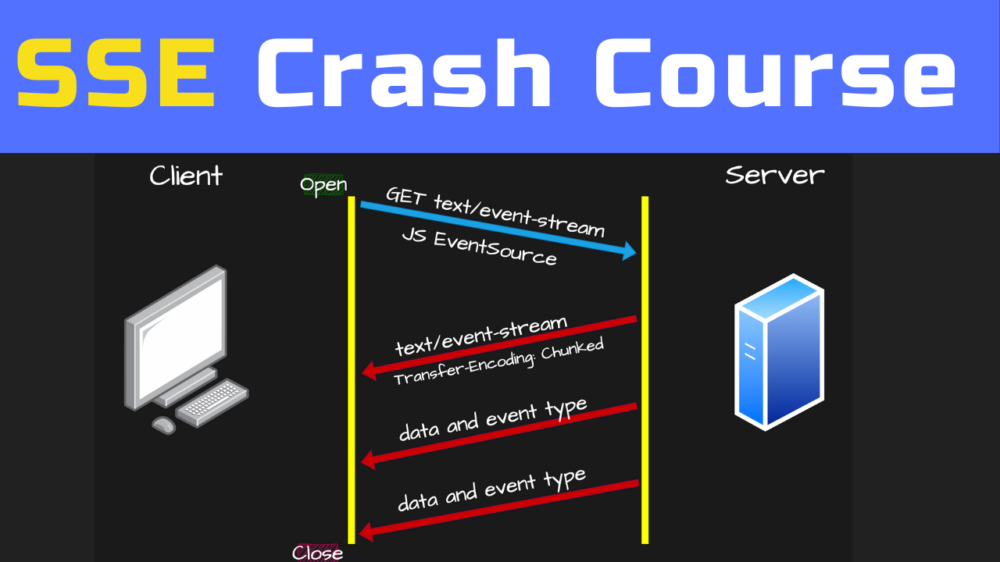

# How to create OpenAI API Key and Example Code with Node.JS

### YouTube Tutorial:

https://youtu.be/BCO2CVbfGco

### Description:

In this tutorial, you'll dive into the world of Server-Sent Events (SSE) with a hands-on approach. We'll guide you through setting up an Express.js server to handle SSE events and creating a simple HTML and JavaScript frontend to manage SSE event streams using EventSource.

🔍 What You'll Learn:

- Setting up an Express.js server for SSE
- Handling SSE event streams with EventSource in JavaScript
- Building a basic client-side implementation with HTML and JS

If you enjoy this tutorial please subscribe, like and share on YouTube.
